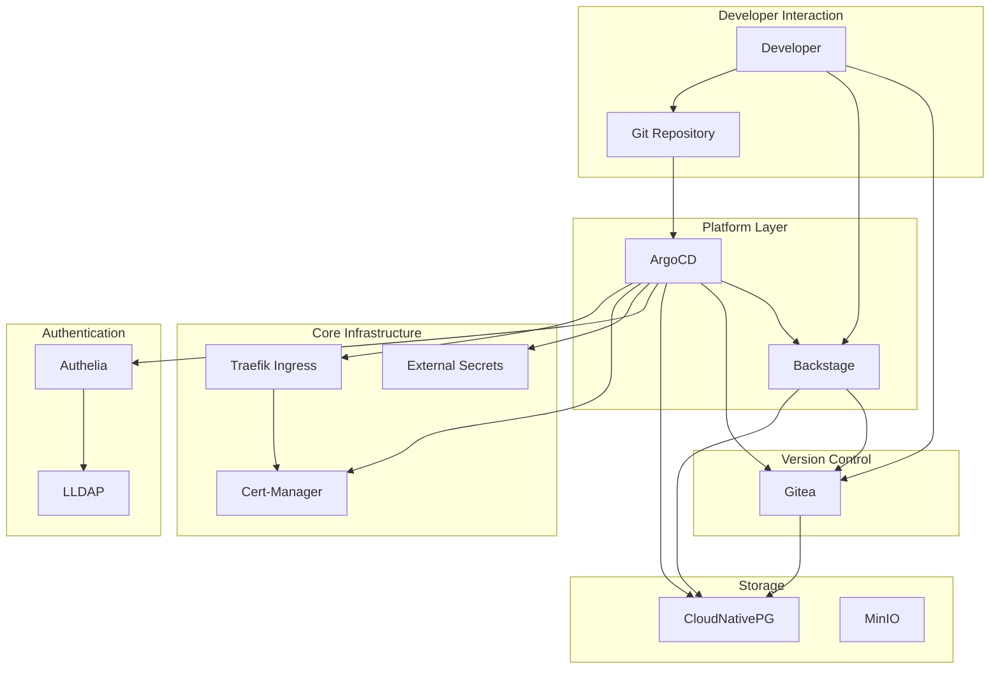
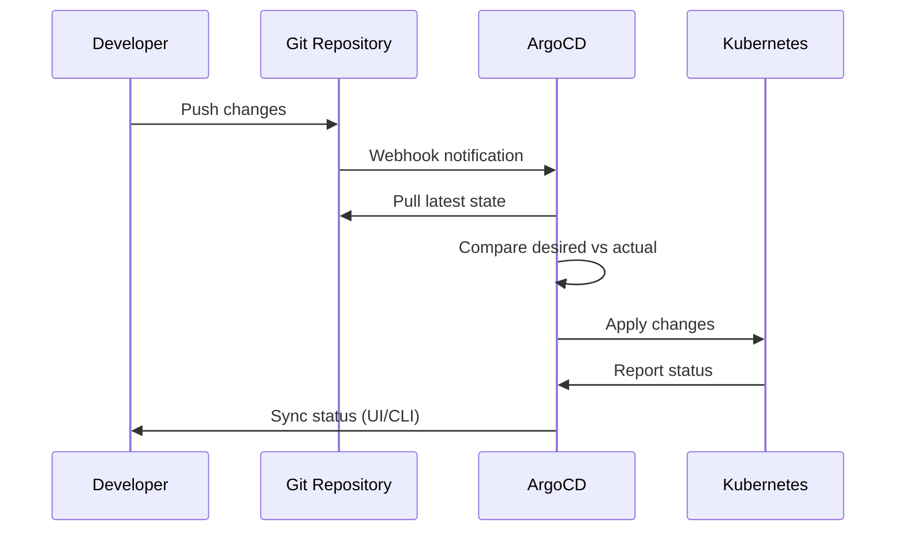
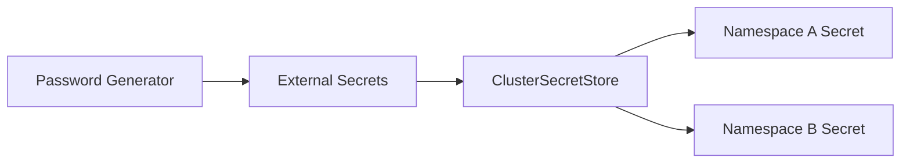

# Architecture Overview

The Local Developer Platform is built on GitOps principles, using ArgoCD to manage all platform components declaratively.

## High-Level Architecture

## Component Categories

### Core Infrastructure

| Component | Purpose |
|-----------|---------|
| **Traefik** | Ingress controller and reverse proxy |
| **Cert-Manager** | Automatic TLS certificate management |
| **External Secrets** | Secure secret management and synchronization |
| **Trust Manager** | Certificate trust bundle distribution |

### Authentication

| Component | Purpose |
|-----------|---------|
| **Authelia** | Single Sign-On (SSO) and OIDC provider |
| **LLDAP** | Lightweight LDAP directory service |

### Orchestration

| Component | Purpose |
|-----------|---------|
| **ArgoCD** | GitOps continuous delivery |
| **Crossplane** | Infrastructure as Code |
| **Kargo** | Progressive delivery and promotion |

### Developer Experience

| Component | Purpose |
|-----------|---------|
| **Backstage** | Developer portal and service catalog |
| **Gitea** | Git repository hosting |

### Storage

| Component | Purpose |
|-----------|---------|
| **CloudNativePG** | PostgreSQL operator for high availability |
| **MinIO** | S3-compatible object storage |

## GitOps Flow

## Namespace Organization

The platform organizes applications into namespaces by category:

| Namespace | Purpose | Components |
|-----------|---------|------------|
| `core` | Core infrastructure | Traefik, Cert-Manager, External Secrets |
| `auth` | Authentication services | Authelia, LLDAP |
| `orchestration` | GitOps and delivery | ArgoCD, Crossplane, Kargo |
| `portal` | Developer portal | Backstage |
| `storage` | Data persistence | CloudNativePG, MinIO |
| `vcs` | Version control | Gitea |

## Secret Management

Secrets flow through External Secrets Operator:

- Secrets are generated or fetched by External Secrets
- ClusterSecretStore enables cross-namespace secret sharing
- Namespace-scoped RBAC ensures least-privilege access

## Next Steps

- [Adding a Helm Chart](../guides/adding-helm-charts.md) - Add new applications to the platform
- [Getting Started](../getting-started/overview.md) - Set up the platform locally
