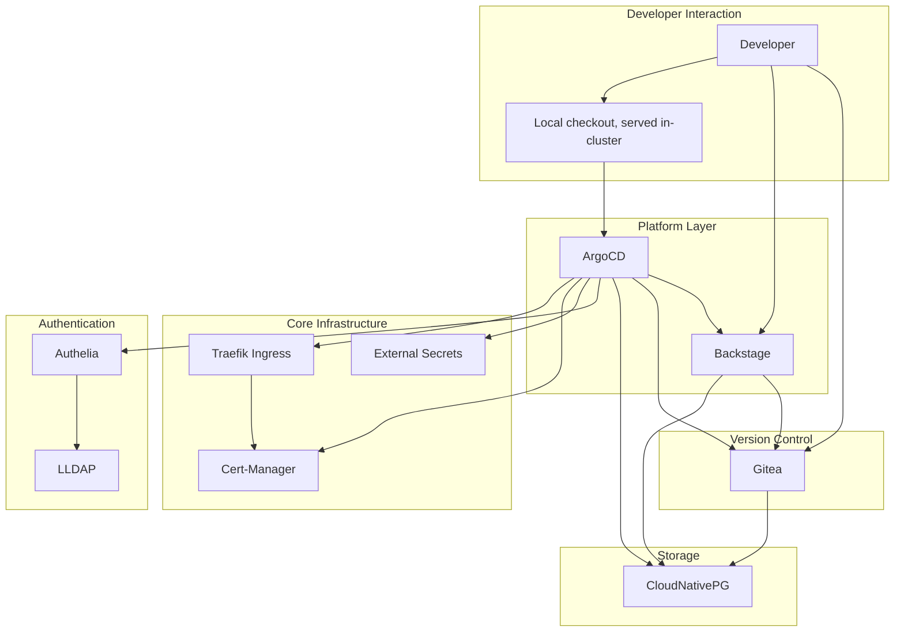
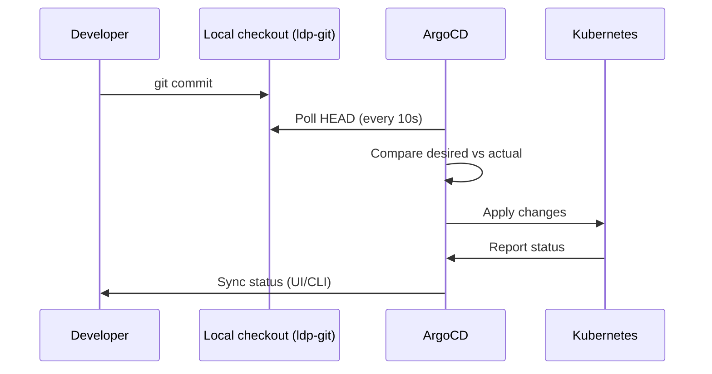
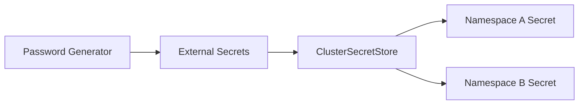

# Architecture Overview

The Local Developer Platform is built on GitOps principles, using ArgoCD to manage all platform components declaratively.

## High-Level Architecture

```mermaid
graph TB
    subgraph "Developer Interaction"
        DEV[Developer]
        GIT[Local checkout, served in-cluster]
    end

    subgraph "Platform Layer"
        ARGO[ArgoCD]
        BACK[Backstage]
    end

    subgraph "Core Infrastructure"
        TRAEFIK[Traefik Ingress]
        CERT[Cert-Manager]
        ESO[External Secrets]
    end

    subgraph "Authentication"
        AUTH[Authelia]
        LDAP[LLDAP]
    end

    subgraph "Storage"
        PG[CloudNativePG]
    end

    subgraph "Version Control"
        GITEA[Gitea]
    end

    DEV --> GIT
    GIT --> ARGO
    DEV --> BACK
    DEV --> GITEA

    ARGO --> TRAEFIK
    ARGO --> CERT
    ARGO --> ESO
    ARGO --> AUTH
    ARGO --> PG
    ARGO --> GITEA
    ARGO --> BACK

    AUTH --> LDAP
    TRAEFIK --> CERT
    GITEA --> PG
    BACK --> PG
    BACK --> GITEA
```

## Component Categories

### Core Infrastructure

| Component | Purpose |
|-----------|---------|
| **Traefik** | Ingress controller and reverse proxy |
| **Cert-Manager** | Automatic TLS certificate management |
| **External Secrets** | Secure secret management and synchronization |
| **Trust Manager** | Certificate trust bundle distribution |

### Authentication

| Component | Purpose |
|-----------|---------|
| **Authelia** | Single Sign-On (SSO) and OIDC provider |
| **LLDAP** | Lightweight LDAP directory service |

### Orchestration

| Component | Purpose |
|-----------|---------|
| **ArgoCD** | GitOps continuous delivery |
| **Crossplane** | Infrastructure as Code |
| **Kargo** | Progressive delivery and promotion |

### Developer Experience

| Component | Purpose |
|-----------|---------|
| **Backstage** | Developer portal and service catalog |
| **Gitea** | Git repository hosting |

### Storage

| Component | Purpose |
|-----------|---------|
| **CloudNativePG** | PostgreSQL operator for high availability |

## GitOps Flow

ArgoCD's source of truth is the checkout you ran `make up` from. The
checkout's `.git` directory is mounted into every kind node and served over
git HTTP by the `ldp-git` Deployment in the `argocd` chart, at
`http://ldp-git.orchestration.svc.cluster.local/ldp.git`. The ApplicationSets
track `HEAD` there, so the platform follows whichever branch is checked out and
picks up each commit within seconds. Nothing is pushed, nothing is fetched from
GitHub, and a push upstream never changes a running platform. Only commits are
deployed; uncommitted edits are invisible.

```mermaid
sequenceDiagram
    participant Dev as Developer
    participant Git as Local checkout (ldp-git)
    participant ArgoCD as ArgoCD
    participant K8s as Kubernetes

    Dev->>Git: git commit
    ArgoCD->>Git: Poll HEAD (every 10s)
    ArgoCD->>ArgoCD: Compare desired vs actual
    ArgoCD->>K8s: Apply changes
    K8s->>ArgoCD: Report status
    ArgoCD->>Dev: Sync status (UI/CLI)
```

To track a shared remote instead, point `platform.repoURL` and
`platform.targetRevision` in `platform-apps/orchestration/argocd/values.yaml`
and `platform-apps/orchestration/tenant-appsets/values.yaml` at it and set
`platform.gitServer.enabled` to `false`.

## Namespace Organization

Each `platform-apps/<category>/` directory deploys into a namespace of the same name:

| Namespace | Components |
|-----------|------------|
| `networking` | Traefik |
| `pki` | cert-manager, trust-manager |
| `secrets` | External Secrets, Reloader, Replicator |
| `auth` | Authelia, LLDAP |
| `orchestration` | ArgoCD, Crossplane, Kargo, KEDA |
| `storage` | CloudNativePG |
| `observability` | metrics-server |
| `vcs` | Gitea, Gitea Actions |
| `portal` | Backstage |
| `devtools` | kagent |

## Secret Management

Secrets flow through External Secrets Operator:

```mermaid
graph LR
    GEN[Password Generator] --> ESO[External Secrets]
    ESO --> CSS[ClusterSecretStore]
    CSS --> NS1[Namespace A Secret]
    CSS --> NS2[Namespace B Secret]
```

- Secrets are generated or fetched by External Secrets
- ClusterSecretStore enables cross-namespace secret sharing
- Namespace-scoped RBAC ensures least-privilege access

## Next Steps

- [Adding a Helm Chart](../guides/adding-helm-charts.md) - Add new applications to the platform
- [Getting Started](../getting-started/overview.md) - Set up the platform locally
