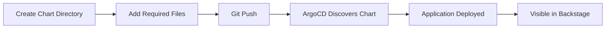

# Adding a Helm Chart to the Platform

This guide explains how to add a new Helm chart to the Local Developer Platform. The platform uses ArgoCD ApplicationSets to automatically discover and deploy Helm charts from the `platform-apps/` directory.

## How It Works



1. You create a chart directory with the required files
2. ArgoCD's ApplicationSet automatically discovers charts by scanning for `values.yaml` files
3. The chart is deployed to a namespace matching its category directory
4. The component appears in Backstage's service catalog

## Directory Structure

All platform applications live under `platform-apps/` organized by category:

```
platform-apps/
├── auth/           # Authentication services (namespace: auth)
├── core/           # Core infrastructure (namespace: core)
├── orchestration/  # GitOps tools (namespace: orchestration)
├── portal/         # Developer portal (namespace: portal)
├── storage/        # Data persistence (namespace: storage)
└── vcs/            # Version control (namespace: vcs)
```

!!! info "Namespace Mapping"
    The category directory name becomes the Kubernetes namespace. For example, a chart at `platform-apps/storage/redis/` will be deployed to the `storage` namespace.

## Required Files

Each Helm chart directory must contain these files:

```
platform-apps/<category>/<chart-name>/
├── Chart.yaml          # Helm chart metadata and dependencies
├── values.yaml         # Configuration values
├── catalog-info.yaml   # Backstage component registration
└── templates/          # Optional: Custom Kubernetes manifests
```

## Step-by-Step Guide

### Step 1: Create the Chart Directory

Choose the appropriate category for your application and create the directory:

```bash
mkdir -p platform-apps/<category>/<chart-name>
```

**Example:** Adding Redis to the storage category:

```bash
mkdir -p platform-apps/storage/redis
```

### Step 2: Create Chart.yaml

The `Chart.yaml` defines your chart metadata and declares the upstream Helm chart as a dependency.

```yaml title="platform-apps/storage/redis/Chart.yaml"
apiVersion: v2
name: redis
description: Redis in-memory data store
version: 1.0.0
type: application

dependencies:
  - name: redis
    version: 20.6.0
    repository: https://charts.bitnami.com/bitnami
```

!!! tip "Finding Chart Information"
    Use [Artifact Hub](https://artifacthub.io/) to find Helm charts and their repository URLs.

**Key Fields:**

| Field | Description |
|-------|-------------|
| `name` | Your chart name (should match directory name) |
| `version` | Your wrapper chart version (typically `1.0.0`) |
| `dependencies[].name` | Upstream chart name |
| `dependencies[].version` | Upstream chart version |
| `dependencies[].repository` | Helm repository URL |

### Step 3: Create values.yaml

The `values.yaml` configures the upstream chart. Values must be nested under the dependency chart name.

```yaml title="platform-apps/storage/redis/values.yaml"
# Values are nested under the upstream chart name
redis:
  architecture: standalone

  auth:
    enabled: true
    password: "your-password"  # Use External Secrets in production

  master:
    persistence:
      enabled: true
      size: 1Gi

  metrics:
    enabled: true
```

!!! warning "Value Nesting"
    All values must be nested under the upstream chart name (e.g., `redis:`). This is how Helm passes values to dependency charts.

### Step 4: Create catalog-info.yaml

Register your component in Backstage's service catalog:

```yaml title="platform-apps/storage/redis/catalog-info.yaml"
apiVersion: backstage.io/v1alpha1
kind: Component
metadata:
  name: redis
  description: Redis in-memory data store for caching and message queuing
  tags:
    - database
    - cache
spec:
  type: service
  lifecycle: production
  owner: maintainers
  system: storage
  dependsOn:
    - component:default/cert-manager
```

**Component Types:**

| Type | Use Case |
|------|----------|
| `service` | Backend services and APIs |
| `website` | Web applications with UI |
| `library` | Shared libraries |
| `infrastructure` | Infrastructure components |

**System Values:**

The `system` field should match your category directory:

- `auth` - Authentication services
- `core` - Core infrastructure
- `orchestration` - GitOps and deployment tools
- `portal` - Developer portal
- `storage` - Data persistence
- `vcs` - Version control

### Step 5: Add Custom Templates (Optional)

If you need additional Kubernetes resources beyond what the upstream chart provides, add them to a `templates/` directory:

```yaml title="platform-apps/storage/redis/templates/external-secret.yaml"
apiVersion: external-secrets.io/v1
kind: ExternalSecret
metadata:
  name: redis-auth
  namespace: {{ .Release.Namespace }}
spec:
  refreshInterval: 1h
  secretStoreRef:
    name: cluster-secret-store
    kind: ClusterSecretStore
  target:
    name: redis-auth
  data:
    - secretKey: redis-password
      remoteRef:
        key: redis
        property: password
```

**Common Template Use Cases:**

- External Secrets for credential management
- Post-install Jobs with Helm hooks
- Custom RBAC (ServiceAccount, Role, RoleBinding)
- ConfigMaps for additional configuration
- Ingress routes (if not handled by upstream chart)

### Step 6: Commit and Push

```bash
git add platform-apps/storage/redis/
git commit -m "feat(storage): add redis helm chart"
git push
```

ArgoCD will automatically detect the new chart and create an Application for it.

## Verification

### Check ArgoCD

1. Open ArgoCD UI
2. Look for a new Application named after your chart
3. Verify the sync status is "Healthy" and "Synced"

### Check Backstage

1. Open Backstage
2. Navigate to the Catalog
3. Search for your component name
4. Verify it appears with correct metadata

### Check Kubernetes

```bash
# Verify the namespace exists
kubectl get namespace <category>

# Check deployed resources
kubectl get all -n <category> -l app.kubernetes.io/name=<chart-name>

# Check pod logs
kubectl logs -n <category> -l app.kubernetes.io/name=<chart-name>
```

## Complete Example

Here's a complete example adding Valkey (Redis-compatible) to the platform:

=== "Chart.yaml"

    ```yaml
    apiVersion: v2
    name: valkey
    description: Valkey - High-performance key-value store
    version: 1.0.0
    type: application

    dependencies:
      - name: valkey
        version: 2.1.0
        repository: https://charts.bitnami.com/bitnami
    ```

=== "values.yaml"

    ```yaml
    valkey:
      architecture: standalone

      auth:
        enabled: true
        existingSecret: valkey-auth
        existingSecretPasswordKey: password

      primary:
        persistence:
          enabled: true
          size: 2Gi

        resources:
          requests:
            cpu: 100m
            memory: 128Mi
          limits:
            cpu: 500m
            memory: 512Mi

      metrics:
        enabled: true
        serviceMonitor:
          enabled: true
    ```

=== "catalog-info.yaml"

    ```yaml
    apiVersion: backstage.io/v1alpha1
    kind: Component
    metadata:
      name: valkey
      description: Valkey high-performance key-value store
      tags:
        - database
        - cache
        - redis-compatible
      links:
        - url: https://valkey.io
          title: Valkey Documentation
    spec:
      type: service
      lifecycle: production
      owner: maintainers
      system: storage
      dependsOn:
        - component:default/external-secrets
    ```

=== "templates/external-secret.yaml"

    ```yaml
    apiVersion: external-secrets.io/v1
    kind: ExternalSecret
    metadata:
      name: valkey-auth
      namespace: {{ .Release.Namespace }}
    spec:
      refreshInterval: 24h
      secretStoreRef:
        name: cluster-secret-store
        kind: ClusterSecretStore
      target:
        name: valkey-auth
      dataFrom:
        - sourceRef:
            generatorRef:
              apiVersion: generators.external-secrets.io/v1alpha1
              kind: Password
              name: valkey-password-generator
    ---
    apiVersion: generators.external-secrets.io/v1alpha1
    kind: Password
    metadata:
      name: valkey-password-generator
      namespace: {{ .Release.Namespace }}
    spec:
      length: 32
      digits: 8
      symbols: 0
      noUpper: false
      allowRepeat: true
    ```

## Best Practices

### Security

- Never commit secrets to `values.yaml` - use External Secrets
- Follow least-privilege for RBAC (use `Role` not `ClusterRole` when possible)
- Enable TLS for ingress routes

### Resource Management

- Always set resource requests and limits
- Enable persistence for stateful applications
- Configure appropriate replica counts for HA

### Observability

- Enable metrics endpoints where available
- Configure ServiceMonitor for Prometheus scraping
- Add meaningful labels and annotations

### Dependencies

- Declare dependencies in `catalog-info.yaml` for visibility
- Ensure dependent services are deployed first (ArgoCD handles this via sync waves if needed)

## Troubleshooting

### Chart Not Appearing in ArgoCD

1. Verify `values.yaml` exists in the chart directory
2. Check the ApplicationSet logs:
   ```bash
   kubectl logs -n orchestration -l app.kubernetes.io/name=argocd-applicationset-controller
   ```

### Sync Failures

1. Check the ArgoCD Application events
2. Look for Helm errors:
   ```bash
   kubectl describe application <chart-name> -n orchestration
   ```

### Component Not in Backstage

1. Verify `catalog-info.yaml` syntax is valid
2. Check Backstage catalog refresh (may take a few minutes)
3. Ensure the `spec.system` matches a valid system

## Next Steps

- [Architecture Overview](../architecture/overview.md) - Understand how components interact
- [External Secrets Guide](#) - Managing secrets securely
- [Ingress Configuration](#) - Exposing services externally
